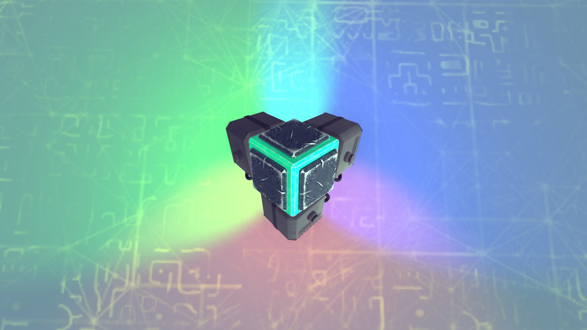
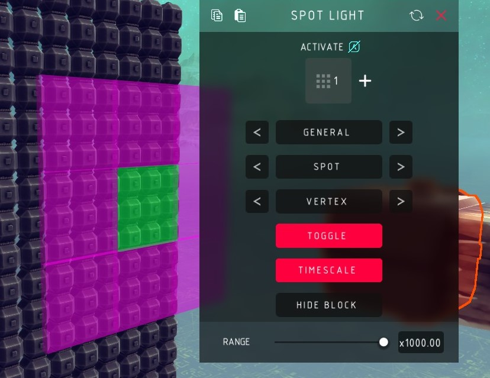
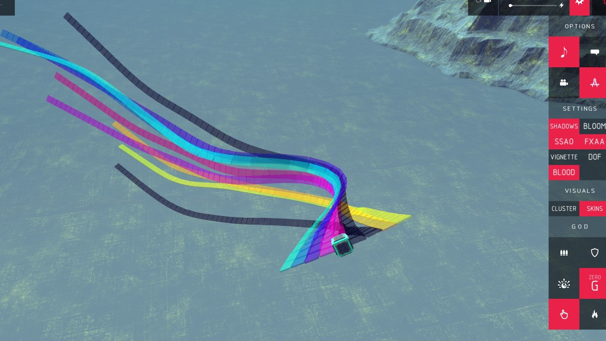
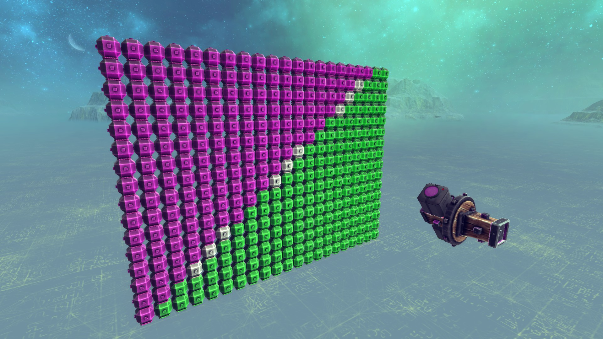
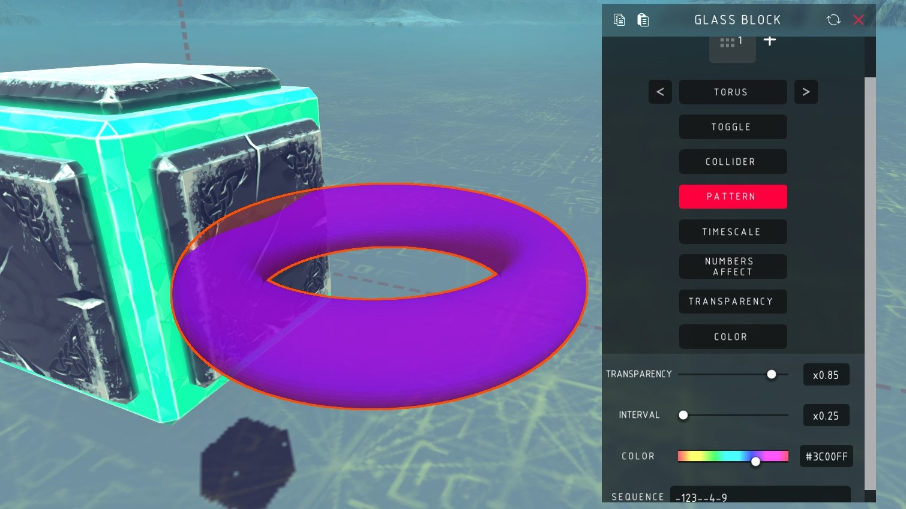
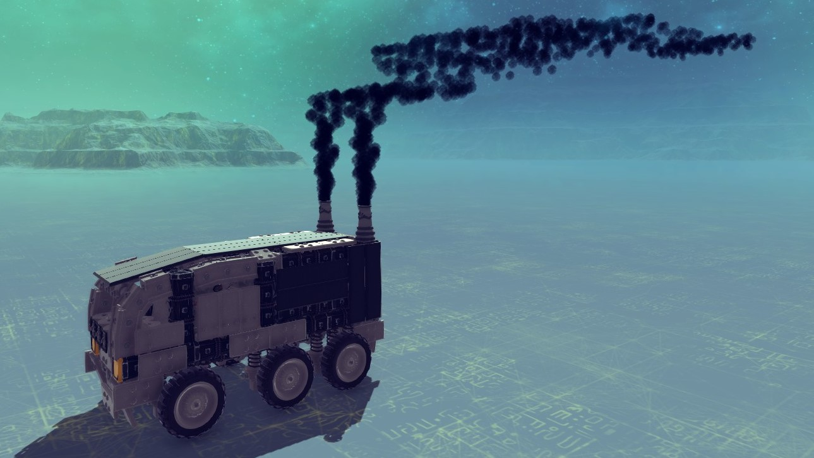
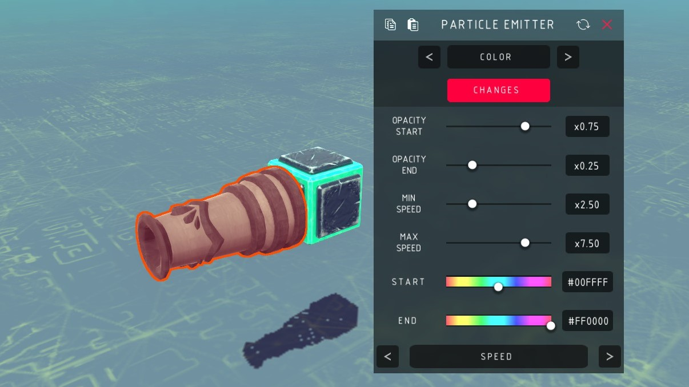
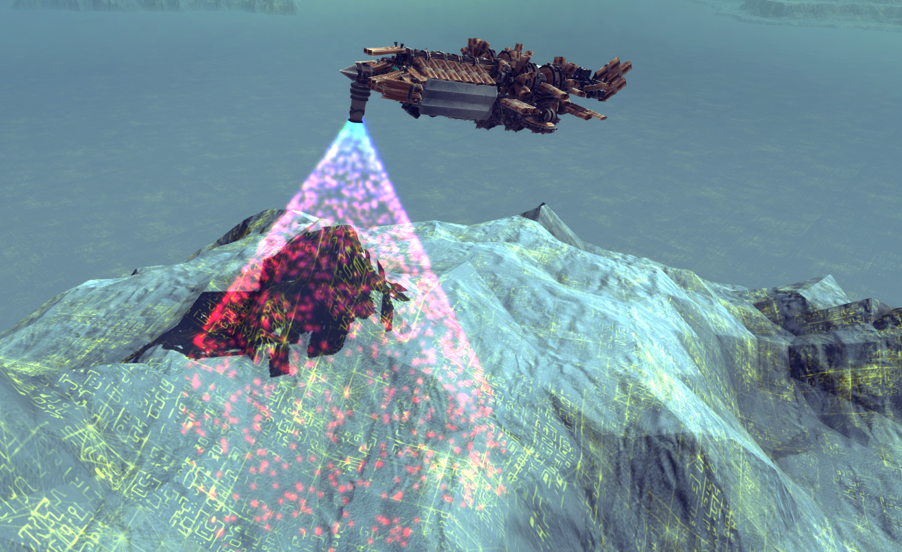
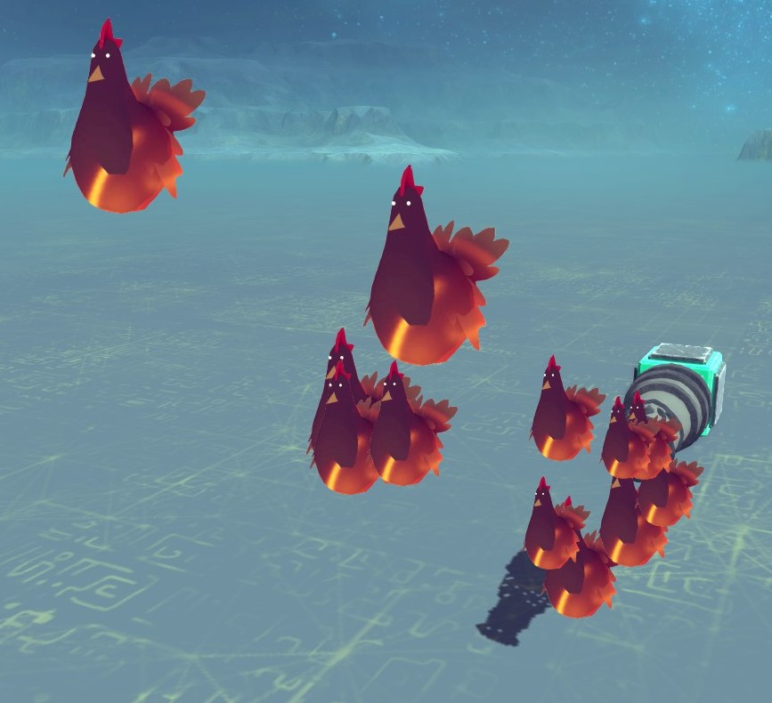
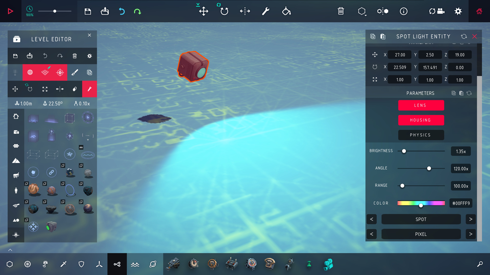

# Besiege Special Effects

Lights, glass, particles and text, in
[Besiege](https://store.steampowered.com/app/346010/Besiege/).



Four blocks that add nothing to how a machine works and everything to how it
looks: a real light you can drive from a key, coloured glass, a particle emitter
with most of Unity's particle system behind it, and a block that writes text in
the world.

## Install

Either subscribe to the mod on Steam, or if you don't use Steam you can clone the
repo then:

```sh
./tools/install.sh              # symlink into Besiege_Data/Mods
./tools/install.sh --copy       # copy instead
./tools/install.sh --uninstall
```

Set `BESIEGE_DIR` if your install isn't found automatically. Start Besiege, enable
**SpecialEffects** in the mods menu, and the four blocks show up in the block menu
— search `spot light`, `glass`, `particle emitter` or `text block`. No C#
toolchain is needed; the build uses Besiege's own compiler.

Most settings are read when the simulation starts, so a slider moved mid-run
takes effect on the next run. The exceptions are the ones that could not work
that way: the strobes, the auto sliders, and the emitter's random modes.

## Spot Light



An actual Unity light on a block. The menu at the top of the mapper switches
between five pages of settings.

| General | What it does |
| --- | --- |
| Activate | Key that switches it on. Default `P` |
| Toggle | Off: hold the key. On: press once on, press again off |
| Range | How far the light reaches |
| Spot / Directional / Point | Light type |
| Pixel / Vertex / Auto | Illumination quality |
| Normal / Hidden / Sphere / Box | The lens. `Hidden` makes the block itself see-through, the other two swap the flat lens for a glowing shape |
| TimeScale | Whether the animated settings follow the game's time scale |

**Brightness**, **Cone Angle** and **Color** are a page each, and all three work
the same way: one value, plus an **Auto** switch that swaps it for a min, a max
and a speed, and sweeps between them.

**Strobe** blinks the lamp to a pattern you type. `-` is a gap, a digit is a
brightness — and a cone angle, and a hue — and anything else holds what is
already set. **Interval** is the time per character, and three toggles pick which
of brightness, cone angle and colour the pattern is allowed to drive.



## Glass Block



A coloured, translucent pane — or a sphere, a poly sphere, or a torus.

| Setting | What it does |
| --- | --- |
| Pane / Sphere / Poly Sphere / Torus | Which mesh |
| Alpha Blend / Additive / Overlay | Which shader. Additive glows |
| Activate | Key that switches it. Default `L` |
| Toggle | Off: hold the key. On: press once on, press again off |
| Inverse state | Starts hidden and the key shows it, rather than the other way round |
| Transparency | `0` is invisible, and at `0` the block stops updating entirely |
| Color | Colour of the glass |
| Collider | Off makes it decoration: no collisions, no mass |
| Pattern | The same strobe the Spot Light has, driving transparency and colour |



## Particle Emitter



A particle system on a block, with most of Unity's particle modules wired to the
mapper. Seven pages, picked with the menu at the top.

| General | What it does |
| --- | --- |
| Activate | Key that emits. Default `K` |
| Toggle | Off: hold the key. On: press once on, press again off |
| Loop | Keep emitting, or emit one burst |
| Speed / Lifetime / Gravity | How the particles are thrown and how long they last |
| Max Particles | Ceiling on how many exist at once |
| Playback speed | Speeds up or slows down the whole system |
| World / Local | Whether particles are left behind or carried with the block |
| No Collider | Makes the block decoration: no collisions, no mass |
| Shader / Texture | What a particle is drawn as — 32 textures, listed in `ParticleEmitter.xml` |

| Page | What it does |
| --- | --- |
| Emission | Rate, and the shape and angle particles are thrown into |
| Dampen | Slows particles down and caps their speed |
| Color | Start and end colour and opacity, and **Heatwave** — below |
| Size | Start and end size |
| Rotation | Starting spin, and how it changes |
| Collision | Whether particles bounce off the world, and how hard |

**Color**, **Size** and **Rotation** each have a **Changes** switch, and when it
is on a menu picks what drives the change: over the particle's **Lifetime**, by
its **Speed**, or **Random** per particle.

**Heatwave** adds a heat haze that bends whatever is behind the particles, drawn
with the game's own distortion shader over a ripple pattern generated in code.
**Heatwave Strength** is how hard it bends.




Some of the 32 textures are more serious than others.



## Text Block

Writes a line of text in the world, using the fonts in the mod's asset bundle.

| Setting | What it does |
| --- | --- |
| Font / Style | Typeface, and normal, bold, italic or both |
| Text | What it says |
| Size | How big |
| Color / Opacity | Colour of the text |
| Letter Spacing | Tighter or looser, `-1` to `1` |
| Collider | Off makes it decoration: no collisions, no mass |

The block's own mesh hides itself once you start simulating, so only the text is
left.

## Console commands

The mod adds two, for the level's lighting:

| Command | Effect |
| --- | --- |
| `Night true` / `false` | Kills the ambient light, and puts it back |
| `Custom <setting> <value>` | Sets one of Unity's render settings directly |

`Custom` takes `ambientLight`, `ambientSkyColor`, `ambientEquatorColor`,
`ambientGroundColor` and `fogColor` as `#RRGGBB`; `ambientIntensity`,
`fogDensity`, `fogStartDistance`, `fogEndDistance`, `flareFadeSpeed`,
`flareStrength` and `haloStrength` as numbers; `fog` as true or false;
`ambientMode` as `Skybox`, `Trilight` or `Flat`; and `up` on its own to apply the
change to everything already lit.

## Spot Light Entity



The Spot Light is also a level editor object, under **Virtual** in the object
list. It lights as soon as you place it, and its settings are on the object's own
panel — the same sliders and colour picker the blocks use.

| Setting | What it does |
| --- | --- |
| Spot / Directional / Point | Light type |
| Pixel / Vertex / Auto | Illumination quality |
| Brightness / Angle / Range | How bright, how wide, how far |
| Color | Colour of the light, and of the lens |
| Lens | Whether the glowing disc in the housing is drawn |
| Housing | Whether the lamp itself is drawn, leaving only the beam |

A level can also change one while it runs, with Besiege's own **Modify Variable**
event. Its *scope of change* picker aims at a single object, so a trigger
anywhere in the level can drive one lamp and leave the rest alone.

| Variable | Sets |
| --- | --- |
| `brightness` | Intensity, `0` to `10` |
| `red` `green` `blue` | One colour channel each, `0`–`1`, or `0`–`255` if any of the three is above `1` |
| `angle` | Cone angle, in degrees |
| `range` | How far the light reaches |
| `type` | `0` spot, `1` directional, `2` point |
| `illumination` | `0` pixel, `1` vertex, `2` auto |
| `lens` | `0` hides the lens, above `0` shows it |
| `housing` | `0` hides the housing, above `0` shows it |

Set a variable **negative** to hand that setting back to its slider. Nothing in
Besiege can delete a variable once it is set, so that is how a level gives a lamp
back after taking it over. Variables are numbers — there are no text variables,
which is why a colour takes three — and `Modify Variable` can add and subtract as
well as set, so repeated events make a fade.

## Notes

The C# for this mod was lost and has been recovered from the shipped 2018
assembly. [docs/RECOVERY.md](docs/RECOVERY.md) is the record of how, and how far
the result can be trusted. [CHANGELOG.md](CHANGELOG.md) lists what was broken in
that build and has since been fixed.

AI agent? see [AGENTS.md](AGENTS.md) for layout, build, and any relevant info.
[docs/MODDING-NOTES.md](docs/MODDING-NOTES.md) has some info on Besiege's modding
API.
